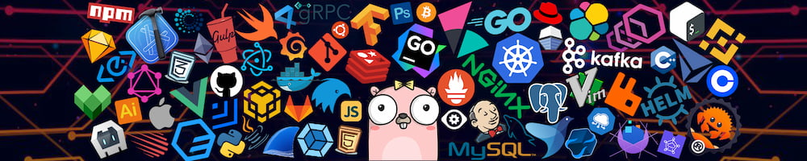

<h1 align="center">🤠 Howdy! I'm Rafael Jaén</h1>



<p align="center">
I am a <strong>fullstack developer</strong> from Cadiz, Spain, who enjoys creating modern, accessible, cross-platform and <strong>open source web applications</strong>. 
</p>
<p align="center"> 
I mostly code in <strong>Typescript</strong> since I fell in love with <strong>Angular</strong> and many other modern web frameworks earlier this year.
</p>
<p align="center"> 
I am <strong>currently working on</strong> a couple of open source projects, including my own <a href="https://github.com/rafitajaen/generatify">Generatify</a>, which is a tool that can be used to <strong>generate strong and secure passwords</strong> for all your online accounts.
</p>
<p align="center"> 
I am <strong>always learning</strong> and passionate about the whole process of building software, <strong>from design to development.</strong>
</p>

<br>

## 🌱 Most Recent Projects I've Worked On! 

<br>

| 🚀 **Projects** | 📋 **Short Description** | 💻 **Technologies** |
| - | - | - |
| [](https://github.com/rafitajaen/generatify) | Secure Password Generator and Strength Checker for Online Accounts. | [](https://angular.io/) [](https://www.typescriptlang.org/) [](https://tailwindcss.com/) [](https://firebase.google.com/) |
| [](https://github.com/rafitajaen/StoreX-WebAPI) | Clean Architecture .NET 6.0 WebAPI built with Multitenancy Support. | [](https://docs.microsoft.com/en-us/dotnet/csharp/) [](https://dotnet.microsoft.com/en-us/) [](https://www.mysql.com/) [](https://azure.microsoft.com/es-es/) |
| [](https://github.com/rafitajaen/StoreX-Blazor-Wasm) | Support the Management of a Store/Warehouse as Simply as Possible. | [](https://dotnet.microsoft.com/en-us/apps/aspnet/web-apps/blazor) [](https://mudblazor.com/) [](https://webassembly.org/) [](https://azure.microsoft.com/es-es/) |
| [](https://github.com/rafitajaen/Blazordex) | Mini Pokedex built with Blazor WebAssembly that consumes PokeAPI. | [](https://docs.microsoft.com/en-us/dotnet/csharp/) [](https://dotnet.microsoft.com/en-us/apps/aspnet/web-apps/blazor) [](https://developer.mozilla.org/en-US/docs/Web/CSS) [](https://firebase.google.com/) |
| [](https://github.com/rafitajaen/pro.imagenes.frases.refranes) | Ready-to-Share Quotes/Proverbs Generator with Background Images.  | [](https://flutter.dev/) [](https://dart.dev/) [](https://admob.google.com/home/) [](https://play.google.com/) [](https://firebase.google.com/) |


<br>
<h2 align="center">
🧐 Let's Get in Touch!
</h2>
<p align="center"> 
I look forward to gaining new knowledge, sharing my experiences, collaborating and creating amazing products to make the world a better place!
</p>

<div align="center">

  [](https://www.linkedin.com/in/rafitajaen/)

</div>

<h3 align="center"> 
If you think we share thoughts, just...
</h3>

```typescript
function makeABetterWorldTogether(world: World): string | never {
    
    const sameThoughts: boolean = compareThinking(world.people.you, world.people.me)

if(sameThoughts)
    return "Just write 'git merge rafitajaen' on the console"
else
    throw new Error("undefined error")

}
```

<p align="center"> 
🧠🏭🤝🌍
</p>